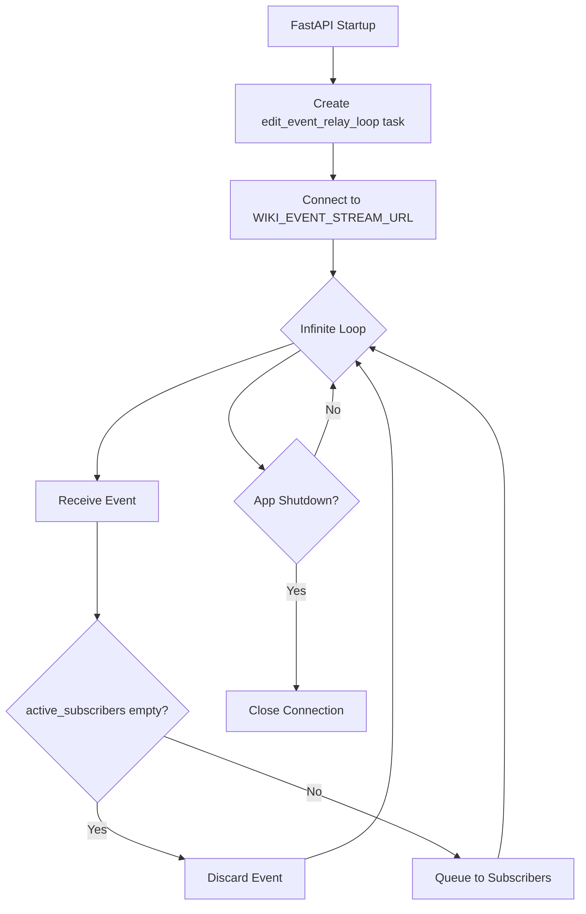
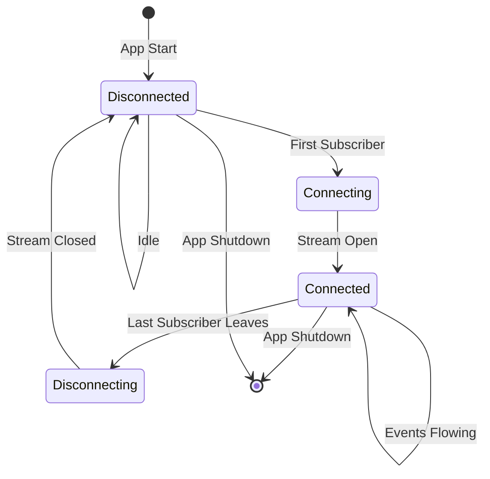

# WIKI_EVENT_STREAM_URL Connection Lifecycle Analysis

## Executive Summary

**Current State:** The connection to `WIKI_EVENT_STREAM_URL` remains open continuously from application startup to shutdown, regardless of whether there are active subscribers.

**Recommendation:** Implement conditional connection management that closes the stream when `active_subscribers` is empty and reopens it when subscribers connect.

---

## Current Architecture

### Connection Flow



### Code Analysis

**Key Functions:**

1. **[`fastapi_lifespan()`](l2wc_api/main.py:68)** (lines 68-98)
   - Creates relay task at startup (line 80)
   - Cancels task on shutdown (lines 90-96)
   - No subscriber-count awareness

2. **[`edit_event_relay_loop()`](l2wc_api/main.py:380)** (lines 380-423)
   - Infinite `while True` loop (line 387)
   - Never checks `len(active_subscribers)`
   - Processes all events even when set is empty

3. **[`filtered_event_generator()`](l2wc_api/main.py:426)** (lines 426-451)
   - Adds/removes subscribers (lines 434, 450)
   - No coordination with relay loop

---

## Resource Impact

### Current Waste When No Subscribers

| Resource | Impact | Severity |
|----------|--------|----------|
| **Network Bandwidth** | Continuous SSE stream (~100-1000 events/sec) | High |
| **CPU** | JSON parsing, event filtering, queue operations | Medium |
| **Memory** | Event objects created and discarded | Low |
| **Server Courtesy** | Unnecessary load on Wikimedia servers | Medium |

### Event Volume Estimate

Based on Wikipedia's edit rate:
- **~1.9 edits/second** across all wikis
- **~6,840 events/hour** when idle
- **~164,160 events/day** processed and discarded

---

## Proposed Solution: Conditional Connection Management

### Architecture Changes



### Implementation Strategy

#### 1. Add Connection State Management

```python
# New global state variables
stream_connection_active = False
stream_connection_lock = asyncio.Lock()
connection_control_event = asyncio.Event()
```

#### 2. Modify `edit_event_relay_loop()`

**Current behavior:**
- Always connected

**New behavior:**
- Wait for first subscriber before connecting
- Monitor subscriber count
- Disconnect after last subscriber leaves (with grace period)

#### 3. Modify `filtered_event_generator()`

**Current behavior:**
- Just adds/removes from `active_subscribers`

**New behavior:**
- Signal relay loop when transitioning 0→1 subscribers
- Signal relay loop when transitioning 1→0 subscribers

#### 4. Add Grace Period

Include a configurable delay (e.g., 30 seconds) before disconnecting to avoid thrashing if subscribers reconnect quickly.

---

## Detailed Implementation Plan

### Step 1: Add State Variables

**File:** [`l2wc_api/main.py`](l2wc_api/main.py:1)
**Location:** After line 64 (after `event_relay_loop_task` declaration)

```python
event_relay_loop_task = None
stream_active = False  # NEW
stream_control_event = asyncio.Event()  # NEW
DISCONNECT_GRACE_PERIOD = 30  # NEW: seconds to wait before disconnecting
```

### Step 2: Refactor Relay Loop

**File:** [`l2wc_api/main.py`](l2wc_api/main.py:380)
**Function:** `edit_event_relay_loop()`

**Changes needed:**
1. Add outer loop that waits for `stream_control_event`
2. Add inner loop that monitors `active_subscribers`
3. Disconnect when subscribers empty for grace period
4. Log connection state changes

### Step 3: Update Subscriber Management

**File:** [`l2wc_api/main.py`](l2wc_api/main.py:426)
**Function:** `filtered_event_generator()`

**Changes needed:**
1. When adding first subscriber (0→1): Set `stream_control_event`
2. When removing last subscriber (1→0): Clear event after grace period
3. Add logging for subscriber transitions

### Step 4: Add Monitoring Endpoint

**New endpoint:** `/api/stream_status`

Returns:
```json
{
  "stream_connected": true,
  "active_subscribers": 3,
  "uptime_seconds": 1234
}
```

---

## Trade-offs Analysis

### Benefits of Optimization

| Benefit | Impact |
|---------|--------|
| **Reduced bandwidth** | Saves ~164K events/day when idle |
| **Lower CPU usage** | No processing when no subscribers |
| **Server courtesy** | Respectful to Wikimedia infrastructure |
| **Better scaling** | Multiple instances don't all maintain connections |

### Costs of Optimization

| Cost | Mitigation |
|------|-----------|
| **Added complexity** | Well-documented, tested code |
| **First-subscriber latency** | Grace period reduces reconnection frequency |
| **State management** | Simple event-based signaling |
| **Potential race conditions** | Use asyncio locks for thread safety |

### First Connection Latency

**Without optimization:** 0ms (already connected)
**With optimization:** ~500-2000ms (connection establishment)
**Mitigation:** 30-second grace period means reconnection rare in practice

---

## Testing Strategy

### Unit Tests

1. **Test subscriber count transitions**
   - 0 → 1 triggers connection
   - 1 → 0 triggers disconnect after grace period
   - 0 → 1 → 0 → 1 within grace period avoids reconnection

2. **Test concurrent subscribers**
   - Multiple simultaneous connections
   - Rapid connect/disconnect patterns

3. **Test edge cases**
   - App shutdown during connection
   - Network failures during disconnect

### Integration Tests

1. Monitor resource usage with 0, 1, and 10 subscribers
2. Measure connection latency for first subscriber
3. Verify no event loss during transitions

### Load Tests

1. Simulate subscriber churn (rapid connect/disconnect)
2. Verify stability over 24-hour period
3. Test with realistic event volumes

---

## Deployment Considerations

### Configuration

Add environment variables:
```bash
DISCONNECT_GRACE_PERIOD=30  # seconds
ENABLE_LAZY_CONNECT=true     # feature flag
```

### Monitoring

Track metrics:
- Connection state transitions per hour
- Time spent connected vs. disconnected
- Average subscriber count
- Failed connection attempts

### Rollback Plan

1. Set `ENABLE_LAZY_CONNECT=false`
2. Falls back to always-connected behavior
3. No data loss or service interruption

---

## Alternative Approaches Considered

### 1. Always Stay Connected (Current)
- **Pro:** Simple, zero latency
- **Con:** Wastes resources when idle
- **Verdict:** Not optimal for production

### 2. Connect/Disconnect Per Subscriber
- **Pro:** Minimal resource usage
- **Con:** Excessive reconnection overhead
- **Verdict:** Too aggressive

### 3. Conditional with Grace Period (Recommended)
- **Pro:** Balances efficiency and responsiveness
- **Con:** Slight complexity increase
- **Verdict:** Best trade-off

### 4. Connection Pool/Sharing
- **Pro:** Could support multiple streams
- **Con:** Overkill for single stream
- **Verdict:** Not needed for this use case

---

## Estimated Implementation Effort

### Code Changes
- Modify `edit_event_relay_loop()`: Core logic update
- Modify `filtered_event_generator()`: Add signaling
- Add state variables: Simple additions
- Add monitoring endpoint: Optional enhancement

### Testing
- Unit tests for state transitions
- Integration tests for resource usage
- Load tests for stability

### Documentation
- Update README with new behavior
- Document configuration options
- Add operational runbook

---

## Conclusion

**The connection to WIKI_EVENT_STREAM_URL does NOT currently close when there are no active subscribers.** The relay loop runs continuously from application startup to shutdown, processing and discarding events even when no clients are connected.

**Recommendation:** Implement conditional connection management with a grace period to:
- Reduce resource consumption during idle periods
- Maintain good performance for active users
- Be a better citizen to Wikimedia's infrastructure

The optimization is straightforward to implement and can be feature-flagged for safe deployment.
